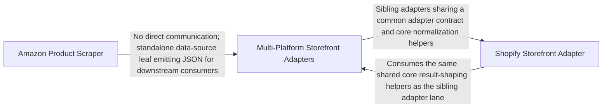

## Details

A standalone script that reads one US Amazon product and its current all-offers panel by ASIN or product URL, parsing offers, prices, parties, and reviews.

### Multi-Platform Storefront Adapters
Implements the storefront adapter contract for the remaining platforms — Magento, WooCommerce, and marketplaces — alongside the shared core helpers they depend on. It detects each platform (e.g., Magento via GraphQL probe or HTML markers), runs search/product/quote operations, and normalizes money, item refs, quote outcomes, and shipping options into the common package-wide shapes. This group is the broad adapter lane that complements the Shopify-specific adapter.

**Related Classes/Methods**:

- `storefront.src.storefront.core.MagentoQuote`:565-567
- `storefront.src.storefront.core.WooCommerceQuote`:561-563
- `storefront.src.storefront.core.WooCommerceSearch`
- `storefront.src.storefront.core.quote_outcome`:614-625
- `storefront.src.storefront.core.shipping_option`:604-607

### Shopify Storefront Adapter
Implements the storefront adapter contract for Shopify by driving the tokenless Storefront GraphQL API. It detects Shopify stores, signs requests via Web Bot Auth when configured, runs product search and variant-detail queries, and computes quotes by creating a cart and reading deferred delivery-group rates. It normalizes raw GraphQL responses into package-wide search-result and quote-outcome shapes using shared core helpers.

**Related Classes/Methods**:

- `storefront.src.storefront.adapters.shopify.Shopify`:160-345
- `storefront.src.storefront.core.ShopifyQuote`
- `storefront.src.storefront.core.ShopifySearch`
- `storefront.src.storefront.core.ShopifyShipping`:576-578
- `storefront.src.storefront.core.search_result`:610-611

### Amazon Product Scraper
A standalone, self-contained script that reads one US Amazon product and its current all-offers panel from either an ASIN or a `/dp/` product URL. It validates the input, bootstraps an anonymous Amazon session, fetches the all-offers (AOD) endpoint, and parses the HTML into a structured result containing the product title, image, reviews/rating, and a normalized offers object (featured + other offers) with per-offer condition, price, seller/shipper parties, and delivery promises. It is the leaf component that turns raw Amazon HTML into a JSON document for downstream consumers.

**Related Classes/Methods**:

- `scripts.amazon_product.lookup`:263-273
- `scripts.amazon_product.fetch`:61-94
- `scripts.amazon_product.parse_product`:97-162
- `scripts.amazon_product.parse_asin`:36-58
- `scripts.amazon_product.main`:276-287

### [FAQ](https://github.com/CodeBoarding/GeneratedOnBoardings/tree/main?tab=readme-ov-file#faq)