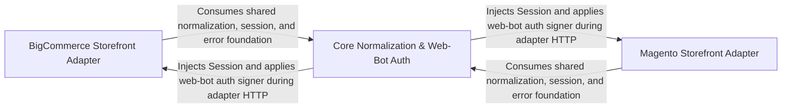

## Details

The central Storefront orchestrator that resolves items, detects stores, fans out work across a thread pool, normalizes variants, persists runs/vendors, and applies web-bot auth signing as a cross-cutting security concern.

### BigCommerce Storefront Adapter
Encapsulates the BigCommerce storefront integration. It provides the `BigCommerce` adapter that performs search against the `/search.php` endpoint, parses product pages and search result links, extracts product data, and drives quote/shipping flows. It also defines the BigCommerce-specific result models (`BigCommerceSearch`, `BigCommerceQuote`, `BigCommerceShipping`) in the core module that carry the normalized outcome of each operation back to the orchestrator. This component is a leaf adapter behind the common adapter interface, invoked by the orchestrator's worker lanes for any store detected as BigCommerce.

**Related Classes/Methods**:

- `storefront.src.storefront.adapters.bigcommerce.BigCommerce`:180-210
- `storefront.src.storefront.adapters.bigcommerce.ProductParser`:131-177
- `storefront.src.storefront.core.BigCommerceSearch`
- `storefront.src.storefront.core.BigCommerceQuote`
- `storefront.src.storefront.core.BigCommerceShipping`:589-591

### Magento Storefront Adapter
Encapsulates the Magento storefront integration. It provides the `Magento` adapter that detects whether to use GraphQL or HTML search, performs catalog searches, resolves product detail pages and links, and handles GraphQL error contracts. It defines the Magento-specific `MagentoSearch` result model in the core module that records the search source (graphql/html), API errors, and omitted configurable products. This component is a leaf adapter behind the common adapter interface, invoked by the orchestrator's worker lanes for any store detected as Magento.

**Related Classes/Methods**:

- `storefront.src.storefront.adapters.magento.Magento`:297-325
- `storefront.src.storefront.adapters.magento.ProductPage`:108-187
- `storefront.src.storefront.adapters.magento._graphql_search`:328-407
- `storefront.src.storefront.core.MagentoSearch`:536-538

### Core Normalization & Web-Bot Auth
Provides the shared, cross-cutting foundation that both the orchestrator and all adapters rely on. It defines the `ToolError` contract, URL canonicalization and origin confinement (`canonical_url`, `normalize_store_url`, `url_origin`), item-reference validation (`validate_ref`, `canonical_ref`), JSON response parsing (`json_list`, `_json`), and the central `normalize_variant` projection that maps any adapter item onto the package-wide product-variant shape. It also houses the web-bot auth signer (`build_signer`, `_signature_headers`, `_key_id`, `_base64url`) that produces Ed25519 HTTP message signatures for storefront sessions requiring bot authentication, applied as an orthogonal security concern during detection and request sending.

**Related Classes/Methods**:

- `storefront.src.storefront.core.normalize_variant`:407-452
- `storefront.src.storefront.core.validate_ref`:336-388
- `storefront.src.storefront.core.canonical_url`:239-245
- `storefront.src.storefront.core.ToolError`:32-33
- `storefront.src.storefront.web_bot_auth.build_signer`:20-48

### [FAQ](https://github.com/CodeBoarding/GeneratedOnBoardings/tree/main?tab=readme-ov-file#faq)