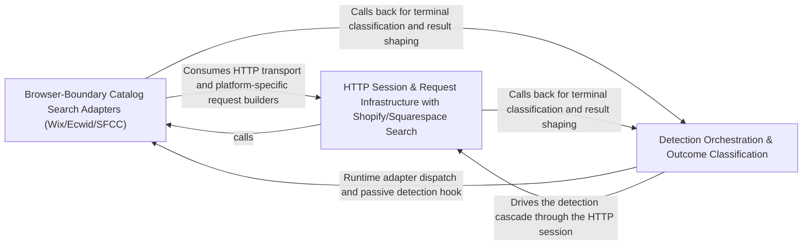

## Details

Detects which e-commerce platform a given store runs on by probing its homepage, classifying positive signals, and surfacing bot-wall/unknown-store outcomes as first-class results.

### Browser-Boundary Catalog Search Adapters (Wix/Ecwid/SFCC)
Implements the search adapters for the three "browser-boundary" platforms — Wix, Ecwid, and Salesforce Commerce Cloud (SFCC) — which publish public catalog search but expose no anonymous exact-detail or cart API. Each adapter (`Wix`, `Ecwid`, `Sfcc`) shares a `_BrowserBoundary` base that returns `api_error`/`unsupported_operation` for product and quote operations, while implementing platform-specific search flows: Wix bootstraps an anonymous access token and queries the catalog-reader API; Ecwid extracts the store ID from the storefront script, resolves the API base, and queries the public products endpoint; SFCC queries its search endpoint. These adapters produce typed search-result contexts (`WixSearch`, `EcwidSearch`, `SfccSearch`) and surface bot-wall terminals via `_wall`.

**Related Classes/Methods**:

- `cross-shop.src.cross_shop.adapters.extra._ecwid_search`:245-283
- `cross-shop.src.cross_shop.core.EcwidSearch`:550-552

### HTTP Session & Request Infrastructure with Shopify/Squarespace Search
Provides the isolated per-store HTTP transport and request-building layer, plus the Shopify and Squarespace search adapters that consume it. The `Session` owns one cookie jar, transport, optional request signer, and an evidence log per store worker; `RequestSpec` encapsulates a URL, params, redirect policy, and allowed redirect origins. The `Session` exposes typed request builders (`storefront_entry`, `detected_entry`, `bigcommerce_search`, `squarespace_search`, `ecwid_script`, etc.) and signed-request handling (`send_shopify`, `_signed_post`, `SignedRedirectBoundary`). The Shopify adapter probes the Storefront GraphQL API for detection and search, while the Squarespace adapter parses search-result HTML via `SearchParser` and fetches product JSON.

**Related Classes/Methods**:

- `cross-shop.src.cross_shop.core.Session`:87-216
- `cross-shop.src.cross_shop.core.RequestSpec`:80-84
- `cross-shop.src.cross_shop.adapters.squarespace.SearchParser`:55-64

### Detection Orchestration & Outcome Classification
The heart of the subsystem. It orchestrates the detection cascade and classifies the final outcome. It defines the first-class result dataclasses (`DetectedStore`, `MagentoDetectedStore`, `StorefrontBotWall`, `UnknownStore`), the bot-wall signature classifier (`wall_system`), and the service-level `_detect` flow that fetches the homepage, runs passive then active detectors, collects and de-duplicates evidence, resolves conflicting platform signals, persists detections to the vendor registry, and returns a typed result. It also provides the `bot_wall`/`gated` terminal helpers used by adapters to surface bot-wall and gated outcomes.

**Related Classes/Methods**:

- `cross-shop.src.cross_shop.core.DetectedStore`:37-43
- `cross-shop.src.cross_shop.core.StorefrontBotWall`:66-72
- `cross-shop.src.cross_shop.core.UnknownStore`:58-62
- `cross-shop.src.cross_shop.core.wall_system`:521-528
- `cross-shop.src.cross_shop.service.CrossShop._detect`:283-331

### [FAQ](https://github.com/CodeBoarding/GeneratedOnBoardings/tree/main?tab=readme-ov-file#faq)