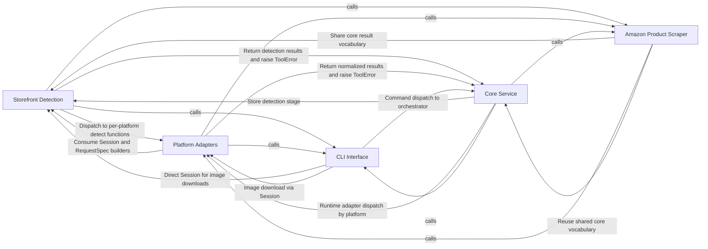

## Details

The `product-search` project is a hybrid AI-agent orchestration skill plus batch CLI/library toolset for e-commerce product sourcing. The five community-detected groups map cleanly onto the project's architectural layers: a Core Service orchestrator that fans out to per-platform Adapters, backed by a Storefront Detection layer, exposed through a CLI Interface, with a standalone Amazon Product Scraper script and cross-cutting web-bot auth security. The toolset is driven through the CLI Interface (cli.main), which parses a command and hands structured entries to the Core Service (Storefront). The service resolves each item, then calls the Storefront Detection layer to classify the target store's platform (or return a bot-wall/unknown result). Once a platform is known, the service fans out per-store work across a thread pool, dispatching to the matching Platform Adapter behind the BoundaryAdapter interface to run search, product, or quote operations. Results are normalized into canonical variants, cached into the run/vendor store, and returned as JSON through the CLI. The Amazon Product Scraper operates as an independent supporting script for direct Amazon offer lookups, while web-bot auth signing is applied orthogonally during detection/requests as a security cross-cutting concern.

### Storefront Detection [[Expand]](./Storefront_Detection.md)
Detects which e-commerce platform a given store runs on by probing its homepage, classifying positive signals, and surfacing bot-wall/unknown-store outcomes as first-class results.

**Related Classes/Methods**:

- `cross-shop.src.cross_shop.core.DetectedStore`:37-43
- `cross-shop.src.cross_shop.core.MagentoDetectedStore`:47-54
- `cross-shop.src.cross_shop.core.StorefrontBotWall`:66-72
- `cross-shop.src.cross_shop.core.Session`:87-216
- `cross-shop.src.cross_shop.core.UnknownStore`:58-62

### Platform Adapters
Implements the per-platform adapter strategy behind the common BoundaryAdapter interface, translating normalized search/product/quote requests into each vendor's catalog API or browser workflow.

**Related Classes/Methods**:

- `cross-shop.src.cross_shop.service.BoundaryAdapter`:38-52
- `cross-shop.src.cross_shop.adapters.extra.Wix`:117-123
- `cross-shop.src.cross_shop.adapters.extra.Ecwid`:126-132
- `cross-shop.src.cross_shop.adapters.extra.Sfcc`:135-141
- `cross-shop.src.cross_shop.adapters.extra._BrowserBoundary`:97-114

### CLI Interface [[Expand]](./CLI_Interface.md)
Provides the command-line entry point (search, product, quote, images, config), argument parsing, and JSON output/error formatting for the toolset.

**Related Classes/Methods**:

- `cross-shop.src.cross_shop.cli.main`:14-37
- `cross-shop.src.cross_shop.cli._parser`:40-66
- `cross-shop.src.cross_shop.cli._json`:93-97
- `cross-shop.src.cross_shop.cli._has_api_error`:100-105
- `cross-shop.src.cross_shop.cli._config`:74-90

### Amazon Product Scraper [[Expand]](./Amazon_Product_Scraper.md)
A standalone script that reads one US Amazon product and its current all-offers panel by ASIN or product URL, parsing offers, prices, parties, and reviews.

**Related Classes/Methods**:

- `scripts.amazon_product.lookup`:263-273
- `scripts.amazon_product.fetch`:61-94
- `scripts.amazon_product.parse_product`:97-162
- `scripts.amazon_product.parse_asin`:36-58
- `scripts.amazon_product.main`:276-287

### Core Service [[Expand]](./Core_Service.md)
The central CrossShop orchestrator that resolves items, detects stores, fans out work across a thread pool, normalizes variants, persists runs/vendors, and applies web-bot auth signing as a cross-cutting security concern.

**Related Classes/Methods**:

- `cross-shop.src.cross_shop.core.ToolError`:32-33
- `cross-shop.src.cross_shop.core.normalize_variant`:407-452
- `cross-shop.src.cross_shop.core.canonical_url`:239-245
- `cross-shop.src.cross_shop.web_bot_auth.build_signer`:20-48

### [FAQ](https://github.com/CodeBoarding/GeneratedOnBoardings/tree/main?tab=readme-ov-file#faq)